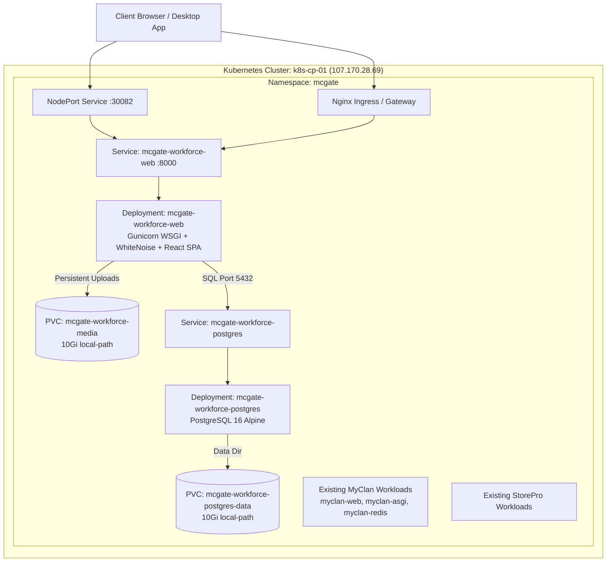
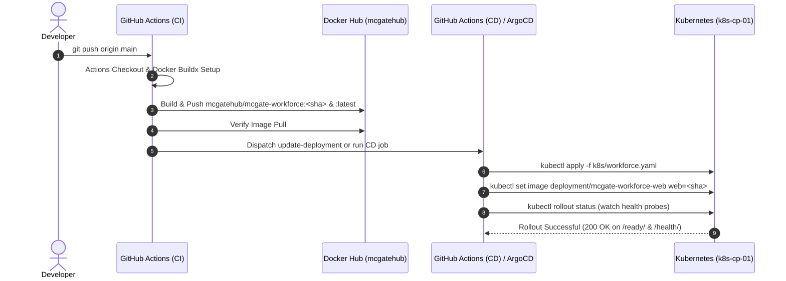

# McGate Workforce — Kubernetes Deployment & CI/CD Architecture

This guide provides the complete technical specification, cluster topology, containerization design, CI/CD pipeline automation, and operational runbook for deploying **McGate Workforce** on the shared production Kubernetes cluster alongside **StorePro** and **MyClan**.

---

## 1. System & Cluster Architecture Overview

McGate Workforce is deployed into the existing `mcgate` Kubernetes namespace on cluster `k8s-cp-01` (`107.170.28.69`).

### Cluster Topology



### Workload Inventory

| Component | Resource Name | Type | Ports / Spec | Storage Mount | Description |
| :--- | :--- | :--- | :--- | :--- | :--- |
| **Frontend & API** | `mcgate-workforce-web` | Deployment (1 replica) | HTTP `8000` | `/app/media` (10Gi RWO) | React 19 SPA + Django 5 REST backend served via Gunicorn & WhiteNoise |
| **Cluster Service** | `mcgate-workforce-web` | Service (ClusterIP) | Port `8000` | — | Internal cluster networking for the web workload |
| **NodePort Gateway** | `mcgate-workforce-nodeport` | Service (NodePort) | Port `8000` &rarr; `30082` | — | Public cluster access at `http://107.170.28.69:30082` |
| **Ingress Rule** | `mcgate-workforce-ingress` | Ingress | Port `80` / `443` | — | Host routing for `workforce.mcgate.app` and `workforce.xentraldesk.com` |
| **Database** | `mcgate-workforce-postgres`| Deployment (1 replica) | TCP `5432` | `/var/lib/postgresql/data` (10Gi) | PostgreSQL 16 Alpine database |
| **Database Service** | `mcgate-workforce-postgres`| Service (ClusterIP) | Port `5432` | — | Internal DB resolution at `mcgate-workforce-postgres:5432` |
| **GitOps Sync** | `mcgate-workforce` | ArgoCD Application | Namespace: `argocd` | — | Automated GitOps sync from repository `k8s/` manifests |

---

## 2. Storage & Rollout Design: The `Recreate` Strategy

> [!IMPORTANT]
> **Single-Replica & ReadWriteOnce (RWO) Storage Constraint**
> Both `mcgate-workforce-web` and `mcgate-workforce-postgres` attach persistent storage backed by the host's `local-path` provisioner. 
> Because `local-path` volumes are bounded to a single node and declare `ReadWriteOnce` access mode, default Kubernetes `RollingUpdate` with `maxSurge: 1` causes volume detachment deadlocks: Kubernetes attempts to boot the new pod replica before terminating the old one, but cannot attach the volume because it is already locked by the running pod.
> 
> Therefore, both deployments explicitly declare:
> ```yaml
> strategy:
>   type: Recreate
> ```
> This guarantees that the terminating pod gracefully unmounts the volume before the new pod mounts it and starts up.

---

## 3. Containerization Design (Multi-Stage Dockerfile)

The container image is built using a clean 3-stage Docker build:

1. **Stage 1 (`frontend-builder`, Node.js 20 Alpine)**:
   - Copies `package.json` and client source.
   - Runs `npm install` and `npm run build`.
   - Produces compiled production bundles in `/app/dist`.

2. **Stage 2 (`builder`, Python 3.12-slim)**:
   - Installs C build headers, `libpq-dev`, `libjpeg-dev`, and `zlib-dev`.
   - Pre-compiles all dependencies from `requirements.txt` into cached binary wheels.

3. **Stage 3 (`runtime`, Python 3.12-slim)**:
   - Installs runtime dependencies (`libpq5`, `libjpeg62-turbo`, `curl`, `gosu`).
   - Creates a dedicated unprivileged user `mcgate` (`uid=1000`).
   - Copies pre-compiled wheels and application source.
   - Copies compiled frontend into both `/app/dist` and `/app/backend/templates/dist`.
   - Pre-collects Django static assets with `python backend/manage.py collectstatic --noinput`.
   - Configures `docker-start.sh` entrypoint and `healthcheck.sh` probe.

---

## 4. Continuous Integration (CI) Workflow

- **Workflow File**: `.github/workflows/ci.yml`
- **Trigger**: Push to `main` or manual trigger (`workflow_dispatch`).



---

## 5. Continuous Deployment (CD) Workflow

- **Workflow File**: `.github/workflows/cd.yml`
- **Trigger**: `repository_dispatch` (event: `update-deployment`) or `workflow_dispatch` with custom `image_tag`.

### Steps Performed by CD Pipeline:
1. Decodes `secrets.KUBE_CONFIG` into `~/.kube/config`.
2. Tests cluster connectivity: `kubectl cluster-info` and `kubectl get nodes`.
3. Ensures namespace `mcgate` and image pull secret `mcgate-dockerhub-secret` exist.
4. Applies all declarative manifests from `k8s/workforce.yaml`.
5. Updates container image: `kubectl set image deployment/mcgate-workforce-web web=mcgatehub/mcgate-workforce:<image_tag> -n mcgate`.
6. Watches rollout status: `kubectl rollout status deployment/mcgate-workforce-web -n mcgate --timeout=600s`.
7. Inspects pod status and logs; triggers automated failure diagnostics on errors.

---

## 6. Required GitHub Secrets

Configure these secrets in your repository settings under **Settings &rarr; Secrets and variables &rarr; Actions**:

| Secret Name | Purpose | Example Value |
| :--- | :--- | :--- |
| `DOCKER_USERNAME` | Docker Hub username | `mcgatehub` |
| `DOCKER_PASSWORD` | Docker Hub Personal Access Token | `dckr_pat_...` |
| `KUBE_CONFIG` | Base64-encoded `~/.kube/config` file for cluster `k8s-cp-01` | `YXBpVmVyc2lvbj...` |
| `CD_REPO_TOKEN` | *(Optional)* GitHub PAT for repository dispatch | `ghp_...` |

### How to generate Base64 `KUBE_CONFIG`:
Run this on your workstation or cluster controller:
```bash
cat ~/.kube/config | base64 -w 0
```
*(On Windows PowerShell: `[Convert]::ToBase64String([System.IO.File]::ReadAllBytes("$HOME\.kube\config"))`)*

---

## 7. ArgoCD GitOps Setup (Optional)

If managing deployments via ArgoCD alongside MyClan:

1. Connect to the cluster and verify ArgoCD:
   ```bash
   kubectl get pods -n argocd
   ```
2. Apply the McGate Workforce application manifest:
   ```bash
   kubectl apply -f k8s/application.yaml
   ```
3. ArgoCD will automatically synchronize manifests from `k8s/` directory into namespace `mcgate`.

---

## 8. Manual Deployment & Troubleshooting Runbook

### Deploying Manually via `kubectl`
```bash
# 1. Apply manifests
kubectl apply -f k8s/workforce.yaml

# 2. Check rollout
kubectl rollout status deployment/mcgate-workforce-postgres -n mcgate
kubectl rollout status deployment/mcgate-workforce-web -n mcgate

# 3. Verify running pods
kubectl get pods -n mcgate -l 'app in (mcgate-workforce-web,mcgate-workforce-postgres)'
```

### Accessing the Running Application
- **Direct NodePort**: `http://107.170.28.69:30082`
- **Health Check**: `http://107.170.28.69:30082/health/`
- **Readiness Check**: `http://107.170.28.69:30082/ready/`
- **Django Admin**: `http://107.170.28.69:30082/django-admin/`

### Viewing Live Logs
```bash
# Web application logs
kubectl logs -f deployment/mcgate-workforce-web -n mcgate

# Database logs
kubectl logs -f deployment/mcgate-workforce-postgres -n mcgate
```

### Performing Emergency Rollback
```bash
# Roll back to previous revision
kubectl rollout undo deployment/mcgate-workforce-web -n mcgate

# View deployment revision history
kubectl rollout history deployment/mcgate-workforce-web -n mcgate
```
